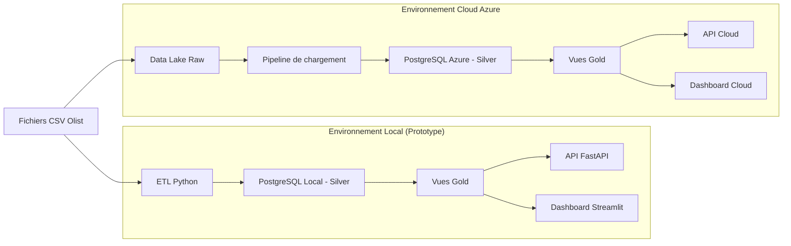

# Data Market – Plateforme de valorisation des données retail

Ce projet consiste à concevoir et implémenter une plateforme de type Data Market permettant de collecter, structurer, exposer et analyser des données dans un contexte de grande distribution (type Carrefour).

L’objectif est de proposer une architecture complète allant de l’ingestion des données jusqu’à leur visualisation métier, en passant par leur transformation, leur sécurisation et leur industrialisation dans le cloud.

Cette solution s’inscrit dans une logique de valorisation de la donnée, en mettant à disposition des utilisateurs métiers des informations fiables, accessibles et directement exploitables.

## Objectifs du projet

Ce projet vise à concevoir une solution data complète permettant de structurer, transformer et valoriser les données dans un contexte retail.

- Concevoir une architecture data complète et cohérente  
- Mettre en place un pipeline ETL de transformation des données  
- Structurer un entrepôt de données (Data Warehouse)  
- Exposer les données via une API  
- Créer une interface de visualisation (dashboard)  
- Garantir la sécurité et la conformité des données (RGPD)  
- Préparer le passage en environnement cloud  

## Dataset utilisé

Le projet s’appuie sur le dataset public Olist E-commerce, adapté pour simuler un environnement retail.

Ce dataset a été enrichi et transformé afin de correspondre aux besoins métier d’un système de fidélité et d’analyse client.

## Transformations principales

- Création de foyers clients  
- Simulation de cartes de fidélité  
- Transformation des commandes en transactions  
- Génération de quantités réalistes  
- Simplification des moyens de paiement  
- Enrichissement des données clients  

## Schéma global de l’architecture

## Architecture Data

Le projet repose sur une architecture Medallion :

- Bronze : données brutes  
- Silver : données nettoyées  
- Gold : données analytiques  

## Modèle de données

Le modèle comprend les entités suivantes :

- Foyers  
- Customers  
- Loyalty_cards  
- Transactions  
- Transaction_items  
- Products  
- Product_categories  

Les diagrammes sont disponibles dans le dossier diagrams.

## Gold Layer

La couche Gold contient des vues analytiques construites à partir des tables Silver.

## Vues disponibles

- transaction_amount  
- customer_value  
- foyer_rfm_metrics  
- foyer_rfm_segments  

## Sécurité des données

- Hachage des emails  
- Chiffrement des données  
- Gestion des accès  
- RGPD  

## Structure du projet

projet-carrefour/

├── data/  
├── notebooks/  
├── scripts/  
├── sql/  
├── init/  
├── api/  
├── streamlit/  
├── diagrams/  
├── docker-compose.yml  
└── README.md  

## Technologies utilisées

- Python  
- PostgreSQL  
- FastAPI  
- Streamlit  
- Docker  

## API (FastAPI)

Exemples :

- /clients  
- /transactions  

## Visualisation (Streamlit)

- KPIs  
- Analyse client  

## Migration vers le Cloud (Azure)

Le projet évolue vers une architecture cloud.

## Objectifs de la migration

- Scalabilité  
- Sécurité  

## Architecture cible

- Data Lake  
- PostgreSQL  

## Étapes de la migration

- Migration des données  
- Déploiement  

## Prototype vs Production

| Prototype (local) | Production (cloud) |
|------------------|-------------------|
| Environnement Docker local | Services managés sur Azure |
| Stockage des données en CSV local | Stockage centralisé (Data Lake) |
| PostgreSQL local | PostgreSQL managé (Azure) |
| Accès limité à localhost | Accès sécurisé via Internet |
| Faible scalabilité | Scalabilité élevée |
| Maintenance manuelle | Supervision et gestion automatisées |