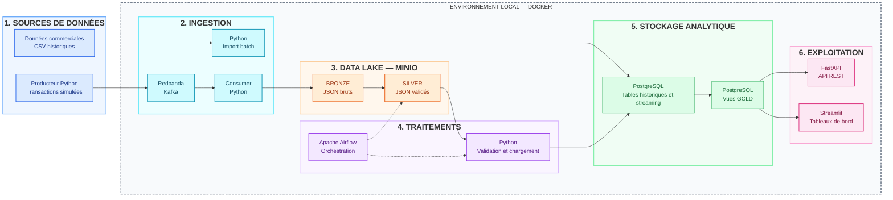

# Architecture Data Lake << Carrefour Data Market (E7) >> 

```mermaid
flowchart LR

    %% 1. SOURCES DE DONNEES
    subgraph SOURCES["<b style='font-size:22px'>1. SOURCES DE DONNÉES</b>"]
        direction TB
        CSV["Données commerciales<br/>CSV historiques"]
        PROD["Producteur Python<br/>Transactions simulées"]
    end

    %% ENVIRONNEMENT LOCAL DOCKER
    subgraph DOCKER["ENVIRONNEMENT LOCAL — DOCKER"]
        direction LR

        %% GROUPE CENTRAL
        subgraph PIPELINE[" "]
            direction TB

            %% 2. INGESTION
            subgraph INGESTION["<b style='font-size:22px'>2. INGESTION</b>"]
                direction TB
                BATCH["Python<br/>Import batch"]
                KAFKA["Redpanda<br/>Kafka"]
                CONSUMER["Consumer<br/>Python"]
                KAFKA --> CONSUMER
            end

            %% ZONE INFERIEURE
            subgraph ZONE_BASSE[" "]
                direction LR

                %% 3. DATA LAKE
                subgraph LAKE["<b style='font-size:22px'>3. DATA LAKE — MINIO</b>"]
                    direction LR
                    BRONZE["BRONZE<br/>JSON bruts"]
                    SILVER["SILVER<br/>JSON validés"]
                    BRONZE --> SILVER
                end

                %% 4. TRAITEMENTS
                subgraph TRAITEMENT["<b style='font-size:22px'>4. TRAITEMENTS</b>"]
                    direction LR
                    AIRFLOW["Apache Airflow<br/>Orchestration"]
                    PYTHON["Python<br/>Validation et chargement"]
                end
            end
        end

        %% 5. STOCKAGE ANALYTIQUE
        subgraph DATABASE["<b style='font-size:22px'>5. STOCKAGE ANALYTIQUE</b>"]
            direction LR
            TABLES["PostgreSQL<br/>Tables historiques et streaming"]
            GOLD["PostgreSQL<br/>Vues GOLD"]
            TABLES --> GOLD
        end

        %% 6. EXPLOITATION
        subgraph EXPLOITATION["<b style='font-size:22px'>6. EXPLOITATION</b>"]
            direction TB
            API["FastAPI<br/>API REST"]
            DASH["Streamlit<br/>Tableaux de bord"]
        end
    end

    %% FLUX BATCH
    CSV --> BATCH
    BATCH --> TABLES

    %% FLUX STREAMING
    PROD --> KAFKA
    CONSUMER --> BRONZE
    SILVER --> PYTHON
    PYTHON --> TABLES

    %% RESTITUTION
    GOLD --> API
    GOLD --> DASH

    %% ORCHESTRATION AIRFLOW
    AIRFLOW -.-> SILVER
    AIRFLOW -.-> PYTHON

    %% COULEURS DES COMPOSANTS
    classDef source fill:#DBEAFE,stroke:#2563EB,color:#1E3A8A,stroke-width:1.5px
    classDef ingestion fill:#CFFAFE,stroke:#0891B2,color:#164E63,stroke-width:1.5px
    classDef lake fill:#FFEDD5,stroke:#EA580C,color:#9A3412,stroke-width:1.5px
    classDef processing fill:#F3E8FF,stroke:#9333EA,color:#581C87,stroke-width:1.5px
    classDef database fill:#DCFCE7,stroke:#16A34A,color:#166534,stroke-width:1.5px
    classDef output fill:#FCE7F3,stroke:#DB2777,color:#831843,stroke-width:1.5px

    class CSV,PROD source
    class BATCH,KAFKA,CONSUMER ingestion
    class BRONZE,SILVER lake
    class AIRFLOW,PYTHON processing
    class TABLES,GOLD database
    class API,DASH output

    %% COULEURS DES SIX ETAPES
    style SOURCES fill:#EFF6FF,stroke:#60A5FA,stroke-width:2px
    style INGESTION fill:#ECFEFF,stroke:#67E8F9,stroke-width:2px
    style LAKE fill:#FFF7ED,stroke:#FDBA74,stroke-width:2px
    style TRAITEMENT fill:#FAF5FF,stroke:#D8B4FE,stroke-width:2px
    style DATABASE fill:#F0FDF4,stroke:#86EFAC,stroke-width:2px
    style EXPLOITATION fill:#FDF2F8,stroke:#F9A8D4,stroke-width:2px

    %% GROUPES DE POSITIONNEMENT
    style PIPELINE fill:transparent,stroke:transparent
    style ZONE_BASSE fill:transparent,stroke:transparent

    %% CADRE DOCKER
    style DOCKER fill:#F8FAFC,stroke:#475569,stroke-width:2px,stroke-dasharray:6 3

    %% POLICE DES COMPOSANTS
    classDef default font-family:Arial,font-size:16px
```
