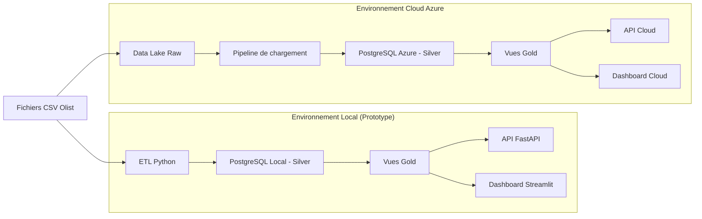

```mermaid
flowchart LR

    %% SOURCE
    A["Fichiers CSV Olist"]

    %% LOCAL
    subgraph LOCAL ["Environnement Local (Prototype)"]
        B["ETL Python"]
        C["PostgreSQL Local - Silver"]
        D["Vues Gold"]
        E["API FastAPI"]
        F["Dashboard Streamlit"]

        B --> C
        C --> D
        D --> E
        D --> F
    end

    %% CLOUD
    subgraph CLOUD ["Environnement Cloud Azure"]
        G["Data Lake Raw"]
        H["Pipeline de chargement"]
        I["PostgreSQL Azure - Silver"]
        J["Vues Gold"]
        K["API Cloud"]
        L["Dashboard Cloud"]

        G --> H
        H --> I
        I --> J
        J --> K
        J --> L
    end

    %% PARALLELISME
    A --> B
    A --> G
```