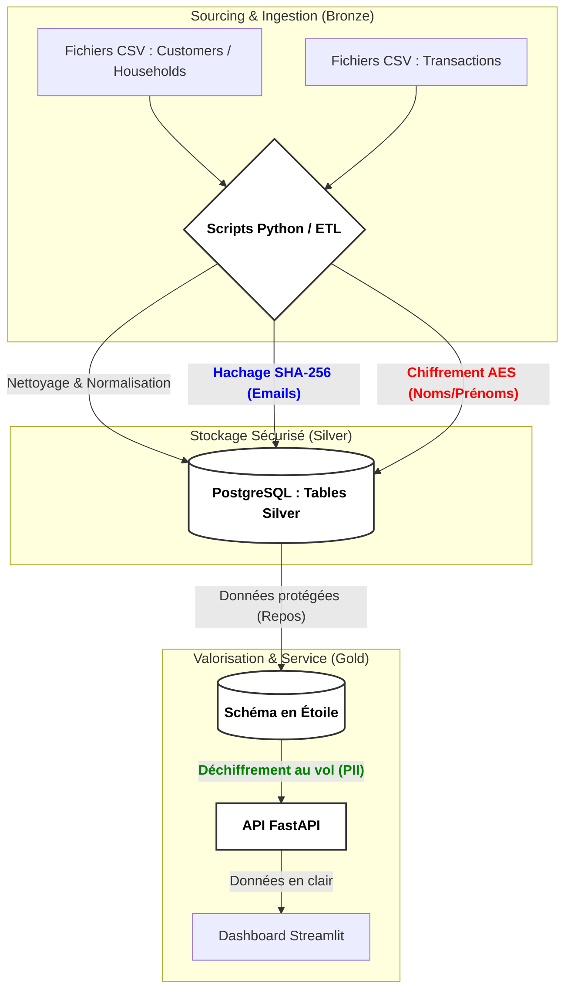

```mermaid
graph TD
    %% Première ligne : Sources et Ingestion
    subgraph "Sourcing & Ingestion (Bronze)"
    
        A1[Fichiers CSV : Customers / Households]
        A2[Fichiers CSV : Transactions]
        B1{<b><font color='black'>Scripts Python / ETL</font></b>}
        
        A1 --> B1
        A2 --> B1
    end

    %% Deuxième ligne : Stockage et Traitement
    subgraph "Stockage Sécurisé (Silver)"
        B2[(<b><font color='black'>PostgreSQL : Tables Silver</font></b>)]
        
        B1 -- "Nettoyage & Normalisation" --> B2
        B1 -- "<b><font color='blue'>Hachage SHA-256 (Emails)</font></b>" --> B2
        B1 -- "<b><font color='red'>Chiffrement AES (Noms/Prénoms)</font></b>" --> B2
    end

    %% Troisième ligne : Analyse et Exposition
    subgraph "Valorisation & Service (Gold)"
        C2[(<b><font color='black'>Schéma en Étoile</font></b>)]
        D1[<b><font color='black'>API FastAPI</font></b>]
        D2[Dashboard Streamlit]

        B2 -- "Données protégées (Repos)" --> C2
        
        %% LE CHANGEMENT EST ICI : Le déchiffrement est l'étape juste avant l'entrée dans l'API
        C2 -- "<b><font color='green'>Déchiffrement au vol (PII)</font></b>" --> D1
        
        D1 -- "Données en clair" --> D2
    end

    %% Styles
    style B1 fill:#FFFFFF,stroke:#333,stroke-width:2px
    style B2 fill:#FFFFFF,stroke:#333,stroke-width:2px
    style C2 fill:#FFFFFF,stroke:#333,stroke-width:2px
    style D1 fill:#FFFFFF,stroke:#333,stroke-width:2px
```
